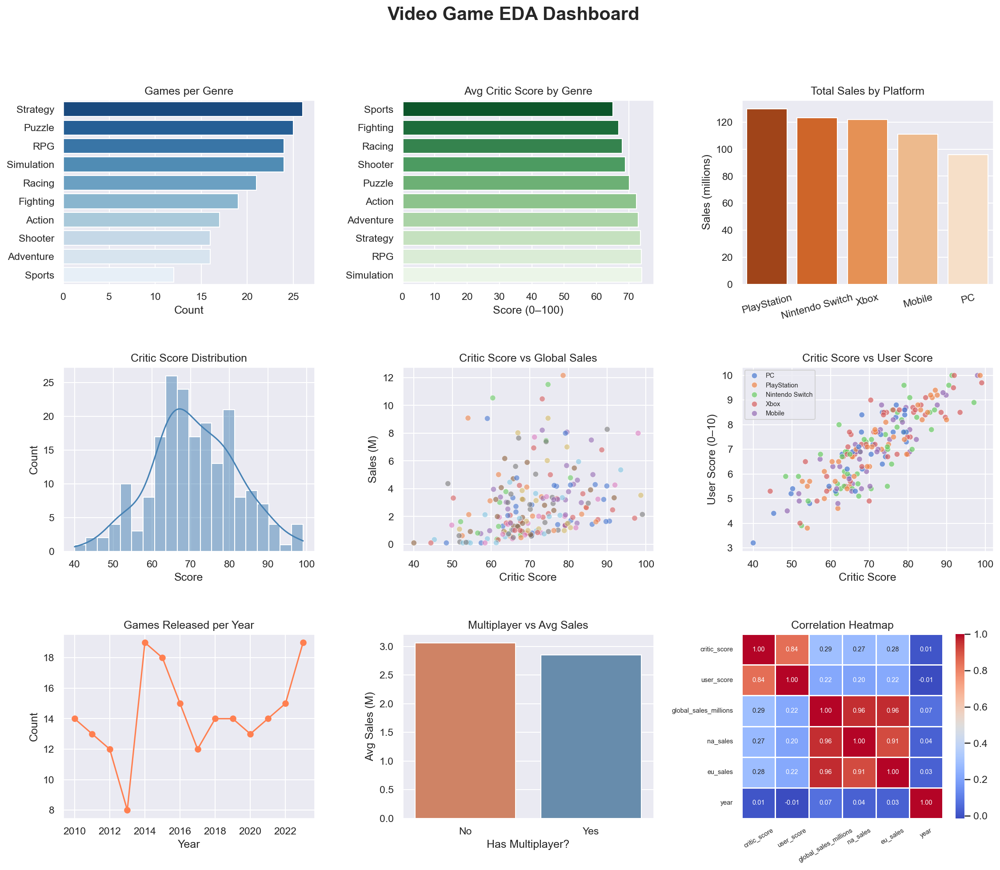

# 📊 Video Game Sales — Exploratory Data Analysis (EDA)

A beginner-friendly Python data analysis project that explores trends in video game sales, critic scores, genres, and platforms using **pandas**, **matplotlib**, and **seaborn**.

---

## 📸 Dashboard Preview



---

## 🔍 What This Project Does

- Loads and inspects a structured CSV dataset (200 games, 12 columns)
- Cleans and summarizes data using `pandas`
- Generates **9 charts** in a single dashboard:
  - Games per genre
  - Average critic score by genre
  - Total global sales by platform
  - Critic score distribution (histogram + KDE)
  - Critic score vs global sales (scatter)
  - Critic score vs user score by platform
  - Games released per year (trend line)
  - Multiplayer vs average sales comparison
  - Correlation heatmap across numeric features

---

## 🛠️ Tech Stack

| Tool | Purpose |
|---|---|
| `pandas` | Data loading, cleaning, groupby aggregations |
| `matplotlib` | Chart layout and rendering |
| `seaborn` | Statistical visualizations |

---

## 🚀 How to Run

**1. Clone the repo**
```bash
git clone https://github.com/YOUR_USERNAME/eda-video-game-dashboard.git
cd eda-video-game-dashboard
```

**2. Install dependencies**
```bash
pip install pandas matplotlib seaborn
```

**3. Run the script**
```bash
python eda_dashboard.py
```

The dashboard will display on screen and save as `eda_dashboard.png`.

---

## 📁 Project Structure

```
eda-video-game-dashboard/
│
├── eda_dashboard.py     # Main analysis script
├── video_games.csv      # Dataset (200 rows, 12 columns)
├── eda_dashboard.png    # Output dashboard image
└── README.md            # Project documentation
```

---

## 📊 Dataset Columns

| Column | Description |
|---|---|
| `title` | Game title |
| `genre` | Game genre (Action, RPG, Sports, etc.) |
| `platform` | PC, PlayStation, Xbox, etc. |
| `publisher` | Game publisher |
| `year` | Release year (2010–2023) |
| `critic_score` | Critic score out of 100 |
| `user_score` | User score out of 10 |
| `global_sales_millions` | Total global sales in millions |
| `na_sales` | North America sales |
| `eu_sales` | Europe sales |
| `multiplayer` | Yes / No |
| `rating` | Age rating (E, T, M, etc.) |

---

## 💡 Key Insights

- **RPG and Simulation** genres consistently score highest with critics
- **PlayStation** leads total global sales across all platforms
- A **moderate positive correlation** exists between critic score and global sales
- **Multiplayer games** outsell single-player titles on average

---

## 🧠 What I Learned

- How to load and explore a dataset with `pandas`
- How to use `groupby()` for aggregations
- How to build multi-chart dashboards with `matplotlib` and `seaborn`
- How to read a correlation heatmap

---

*This is Project 1 of 5 in my Python Data/ML learning roadmap.*
